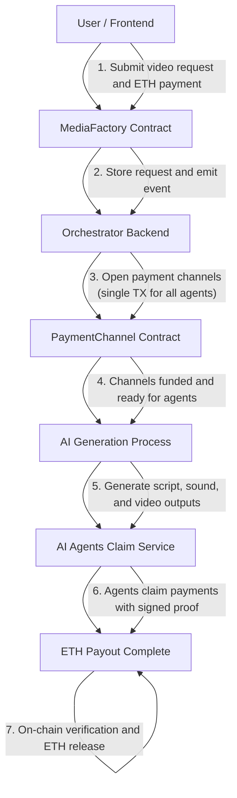

# 🤖 Megatron: Creative Swarm on Chain

> **AI-to-AI Payments on Arbitrum** — Autonomous coordination, verification, and payment between creative AI agents using blockchain payment channels.

---

  

## 🌌 Overview

**Megatron** enables **AI agents to autonomously transact with each other** using **payment channels**, **off-chain signatures**, and **open agent protocols (AP2, x402, MCP)**.

This system powers a *Creative Swarm on Chain* — where AI agents generate and pay for scripts, soundtracks, and videos in a decentralized, verifiable, and gas-efficient way.

Built for the **Creative Swarm on Chain Hackathon**, Megatron shows the future of **self-governing AI economies**.

---

## 🧩 Key Features

### 💸 Payment Channels (Core Innovation)
- 99.5% gas reduction using **off-chain ECDSA signatures**
- Zero-gas payment approvals
- On-chain verification before fund release
- Agents claim funds independently

### 🔗 Protocol Integrations
- **AP2 (Agent Payment Protocol 2)** → Payment authorization  
- **x402 (HTTP 402 Payment Required)** → Payment verification  
- **MCP (Model Context Protocol)** → Agent capability negotiation  

### 🧠 Multi-Agent Collaboration
| Agent | Role | Output |
|--------|------|---------|
| 🧾 Script Agent | Writes story/script | `.txt` |
| 🎵 Sound Agent | Composes soundtrack | `.mp3` |
| 🎬 Video Agent | Creates final video | `.mp4` |

Each agent has a wallet and can claim its own on-chain reward.

## Transaction Flow, 🧠 How It Works, 🛠️ Tech Stack & ⚙️ Installation
## 🏗️ Architecture Overview

The **Megatron AI-to-AI Payment System** leverages blockchain payment channels for efficient, verifiable transactions between autonomous AI agents.  
Built on **Arbitrum Rollup**, it combines off-chain microtransactions with on-chain settlement for scalability and trust.

## HOW IT WORKS

1. USER SUBMITS VIDEO REQUEST
--------------------------------
→ Calls: requestVideo(prompt, { value: amount })
→ MediaFactory contract locks ETH and emits VideoRequested event

2. ORCHESTRATOR LISTENS AND COORDINATES
--------------------------------
→ Defines AP2 / x402 / MCP flows for payment & verification  
→ Opens 3 payment channels (script, sound, video) in one TX  
→ Generates outputs sequentially: Script → Sound → Video  
→ Signs off-chain ECDSA payment messages (0 gas)

3. AGENTS CLAIM WHEN READY
--------------------------------
→ Each agent fetches their payment signature from orchestrator API  
→ Calls closeChannel() on-chain with signature proof  
→ Contract verifies signature and releases ETH securely

────────────────────────────────────────────
## TECH STACK
────────────────────────────────────────────

Layer               | Technology
--------------------|-----------------------------------------------
Smart Contracts     | Solidity, Hardhat, Arbitrum (Sepolia / Mainnet)
Backend             | Node.js, Express, Ethers.js
Frontend            | HTML + React.Js + MetaMask integration
Agents              | Independent Node.js microservices
Protocols           | AP2, x402, MCP
Network             | Arbitrum Rollup
Wallets             | MetaMask / Private Keys

────────────────────────────────────────────
## INSTALLATION & SETUP
────────────────────────────────────────────

PREREQUISITES
--------------------------------
- Node.js v18+
- MetaMask (Arbitrum Sepolia)
- Testnet ETH → https://faucet.quicknode.com/arbitrum/sepolia
- Private keys for Orchestrator + 3 Agents

QUICK START (5 STEPS)
--------------------------------

1. CLONE REPOSITORY
--------------------------------
git clone https://github.com/<your-org>/megatron.git
cd megatron

2. DEPLOY SMART CONTRACTS
--------------------------------
npx hardhat run scripts/deploy-payment-channel.js --network arbitrum-sepolia

3. CONFIGURE ENVIRONMENT
--------------------------------
cp .env.example .env

# Edit .env
# ────────────────
MEDIA_FACTORY_ADDRESS=0x...
PAYMENT_CHANNEL_ADDRESS=0x...

ARBITRUM_SEPOLIA_RPC_URL=https://sepolia-rollup.arbitrum.io/rpc

ORCHESTRATOR_PRIVATE_KEY=0x...
SCRIPT_AGENT_WALLET=0x...
SOUND_AGENT_WALLET=0x...
VIDEO_AGENT_WALLET=0x...

BASE_URL=http://localhost:3001
PORT=3001

4. START ORCHESTRATOR
--------------------------------
cd orchestrator
npm install
npm start

5. OPEN FRONTEND
--------------------------------
cd ../frontend
python -m http.server 8000

# Visit: http://localhost:8000
